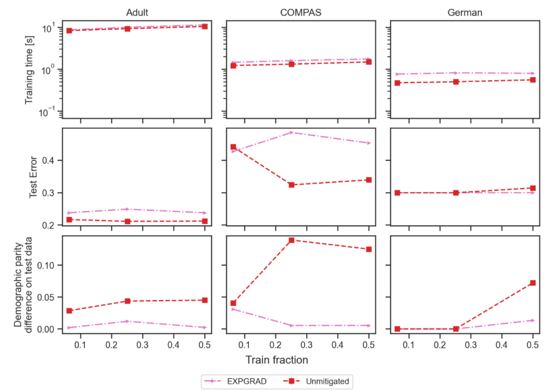

# Fairnesseval Demonstration

A demonstration web application for FairnessEval is available.  
To run the demonstration, navigate to the `streamlit` folders and run the streamlit server:

```bash
cd fairnesseval
cd streamlit 
streamlit run Fairnesseval.py
```

## DEMO input example

Here I will show you how to use the demo by providing input examples for the different models and datasets.


### Example 1: N models on 1 datasets
If models have similar parameters, you can use the same parameters for all models. 
Not specified exclusive parameters of each model will be set at their default value.

- Dataset: `german`
- Model: `Calmon`, `Feld`, `ThresholdOptimizer`, `ZafarDI`
- Model parameters:

```python
{'base_model_code': 'lr', 'base_model_grid_params': {'C': [0.1]}}
```
- Train Fractions: `[0.25]`
- [optional] Experiment ID: `eg1` (reference for demo Plot examples)
- Default values for others.

`This experiment took about 15s on a common laptop.`

### Example 2: Exponentiated Gradient with Logistic Regression on M dataset

- Dataset: `adult`, `compas`, `german`
- Model: `expgrad`
- Model parameters:

```python
{'eps': 0.005,
 'base_model_code': ['lr'],
 'constraint_code': 'dp',
 'base_model_grid_params': {'C': [0.1]}}
```

- Train Fractions: `[0.063, 0.251, 0.5]`
- Train Test fold: `[0]`
- [optional] Experiment ID: `eg2` (for demo Plot examples)
- Default values for others.


>This experiment took about 45s on a common laptop. It may take longer the at the first exec to download the datasets. 

### Example 3: Unmitigated Logistic Regression on M dataset

- Dataset: `adult`, `compas`, `german`
- Model: `unmitigated`
- Model parameters:

```
{ 'base_model_code': ['lr'],
 'base_model_grid_params': {'C': [0.1]}}
```
- Train Fractions: `[0.063, 0.251, 0.5]`
- Train Test fold: `[0]`
- [optional] Experiment ID: `eg3` (for demo Plot examples)
- Default values for others.


`This experiment took about 40s on a common laptop.`

### Example 4: N models on M datasets

- Dataset: `adult`, `compas`, `german`
- Model: `Calmon`, `Feld`, `ThresholdOptimizer`, `ZafarDI`
- Model parameters:

```python
{'base_model_code': 'lr', 'base_model_grid_params': {'C': [0.1]}}
```

- Train Fractions: `[0.25]`
- Train Test fold: `[0, 1]`
- Default values for others.

### Deleting experiments
If you want to delete a single experiment, you can navigate and delete the folder with the experiment id in the `results` folder
that is shown at the end of the Experiment definition and execution page.


## Plot examples
#### Examples using 'Presentation single dataset':
> Select the experiment id of the Example 1. (eg1)

- Experiment ID: `eg1` (or as defined in the input example 1)
- X-Attributes: train_DemographicParity | test_DemographicParity 
- Y-Attributes: train_error | test_error | time
- Others: default

 
The following image contains 3 examples of this utility.


#### Example using 'Presentation multiple datasets':
>Select the experiment id of the Example 2 and 3. (eg2, eg3)

- Experiment ID: `eg2, eg3` (or as defined in the input example 2, 3)
- X-Attributes: `train_fraction`
- Y-Attributes: `time, test_error, test_DemographicParity`
- Groupin attributes: `train_fraction`
- Others: default



## Debugging

If something goes wrong during an experiment, you can copy the experiment definition displayed in the console
at the beginning of the experiment launch and debug it in the python environment to debug the issue.
For instance: you can copy-paste the experiment definition similarly to the comment in
`fairnesseval/experiment_routine.py` and run that module in the python environment.
(`python -m fairnesseval.experiment_routine`).

This is what you may put in the main function of `experiment_routine.py` should look like:

```python
from fairnesseval import run

if __name__ == "__main__":
    run.launch_experiment_by_config({"experiment_id": "demo.05",
                                     "dataset_names": ["adult"],
                                     "model_names": ["Calmon"],
                                     "model_params": {"base_model_code": "lr",
                                                      "base_model_grid_params": {"C": [0.1, 1]}},
                                     "results_path": "path/to/results/CHANGE_ME",
                                     "params": ["--debug"]})
```

## Other experiment examples in code format used in the demo video

In [experiment_definitions.py](..%2Fsrc%2Ffairnesseval%2Fexperiment_definitions.py) you can find example experiment
definitions, these include the experiments used in the demonstration video and in the demo article.

```python
sigmod_datasets = ['adult', 'compas', 'german', ]
TRAIN_FRACTIONS_SMALLER_DATASETS_v1 = [0.063, 0.251, 1.]
BASE_EPS_V1 = [0.005]
demo_examples = [
    {
        'experiment_id': 'live.demo.0',
        'dataset_names': ['adult', 'compas', 'german', ],
        'model_names': ['expgrad'],
        'model_params':
            {'eps': 0.005,
             'base_model_code': ['lr'],
             'constraint_code': 'dp',
             'base_model_grid_params': {'C': [0.1, 1]}},
        'train_fractions': [0.063, 0.251, 1.],
        'random_seeds': [0],
    },

    {
        'experiment_id': 'live.demo.1',
        'dataset_names': ['adult', 'compas', 'german', ],
        'model_names': ['ThresholdOptimizer', 'Feld', 'Calmon', 'ZafarDI', 'ZafarEO', ],
        'model_params': {'base_model_code': 'lr',
                         'base_model_grid_params': {'C': [0.1, 1]}},
        'train_fractions': [0.25],
        'random_seeds': [0],
    },

    {'experiment_id': 'demo.D.0r',
     'dataset_names': ['adult', 'compas', 'german', ],
     'model_names': ['expgrad'],
     'model_params': {'base_model_code': 'lr',
                      'constraint_code': 'dp',
                      'eps': [0.005],
                      'base_model_grid_params': {'C': [0.1, 1]}},
     'random_seeds': [0],
     'train_fractions': [0.063, 0.251, 1.],
     },
    {'experiment_id': 'demo.D.1r',
     'dataset_names': ['adult', 'compas', 'german', ],
     'model_names': ['LogisticRegression'],
     'random_seeds': [0],
     'train_fractions': [0.063, 0.251, 1.],
     },

    {'experiment_id': 'demo.A.1r',
     'dataset_names': ['adult'],
     'model_names': ['ThresholdOptimizer', 'Feld', 'ZafarDI', ],
     'model_params': {'base_model_code': ['lr'],
                      'constraint_code': 'dp',
                      'base_model_grid_params': {'C': [0.1, 1]}},
     'random_seeds': [0],
     },
]


```

